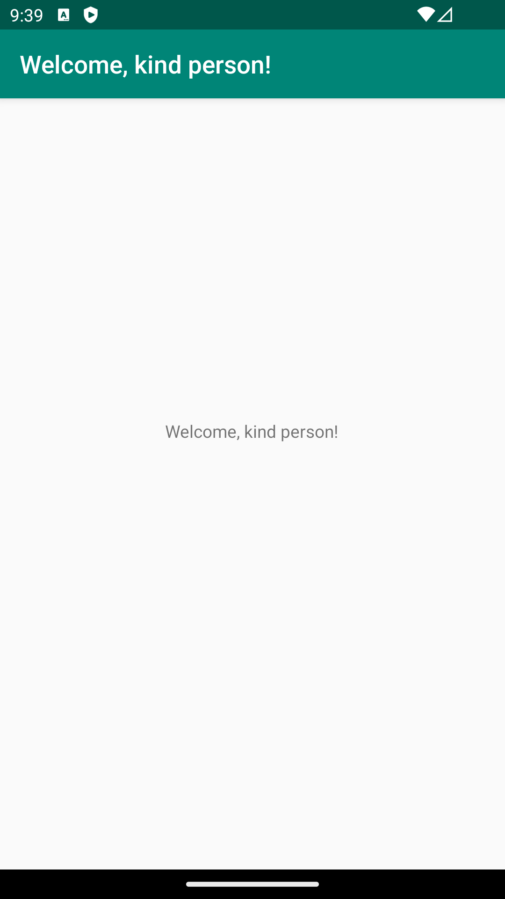

# Rapport

**Först skapades ett konto på GitHub för att kunna hämta "hello"-projektet och göra en fork till mitt konto.
Sedan klonade jag projektet och öppnade det med "Android Studio". Där ändrade jag texten för app_name i strings.xml 
till "Welcome, kind person!". Sedan kunde jag öppna appen i en virtuell divice och se att appen kunde köras på den.
Kod där texten för string - app_name ändrades:



**


```
<resources>
    <string name="app_name">Welcome, kind person!</string>
</resources>
```
